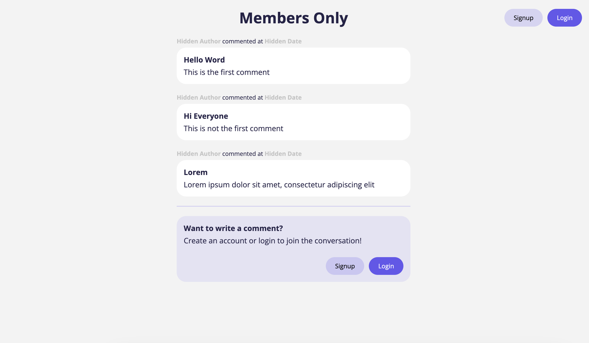
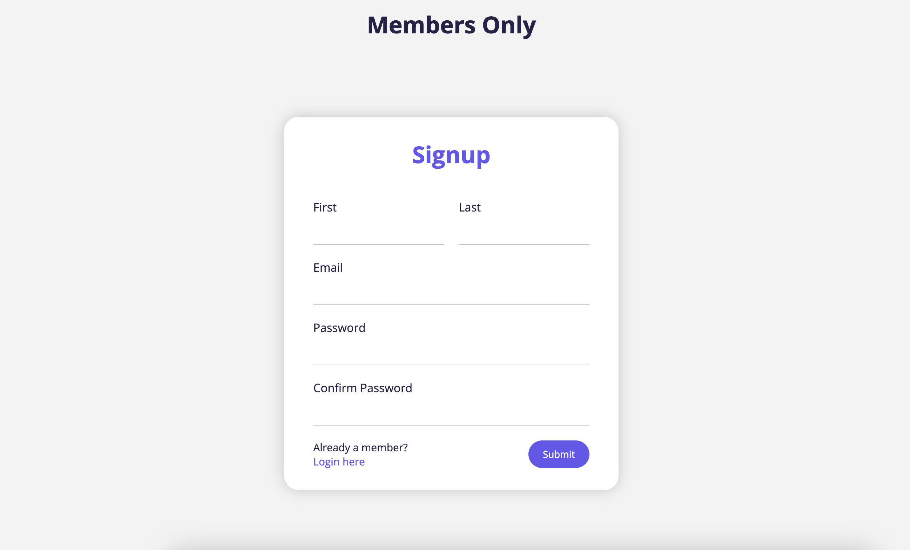
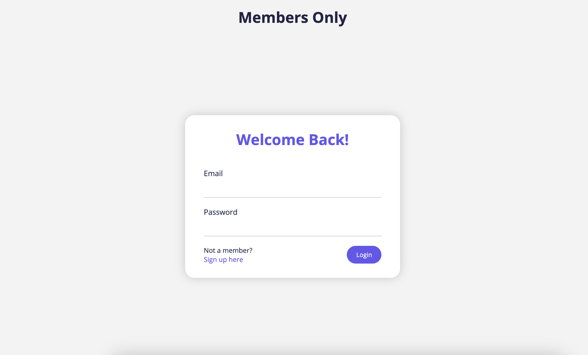
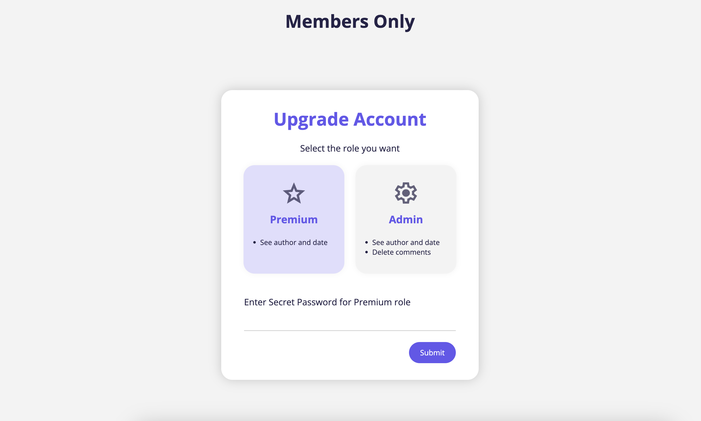
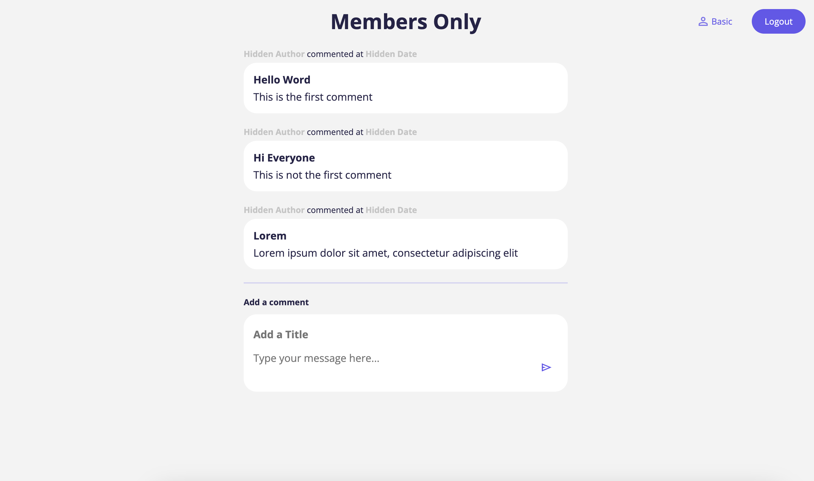
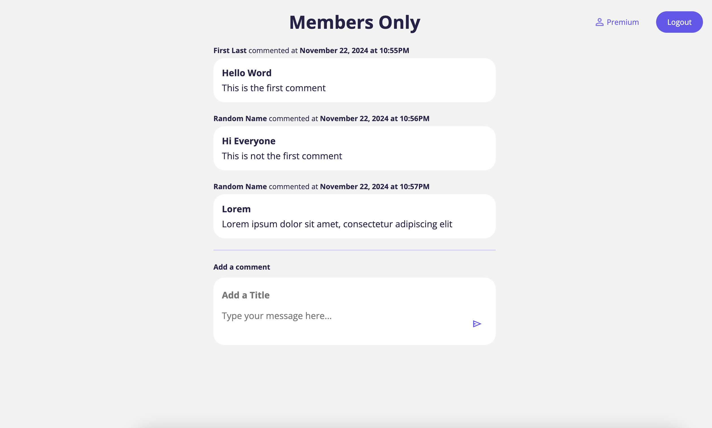
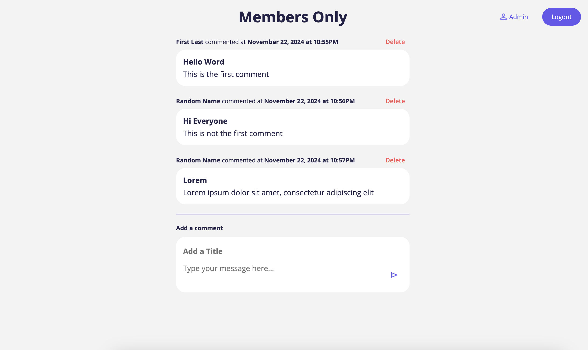
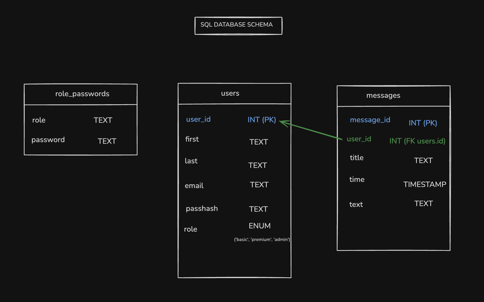
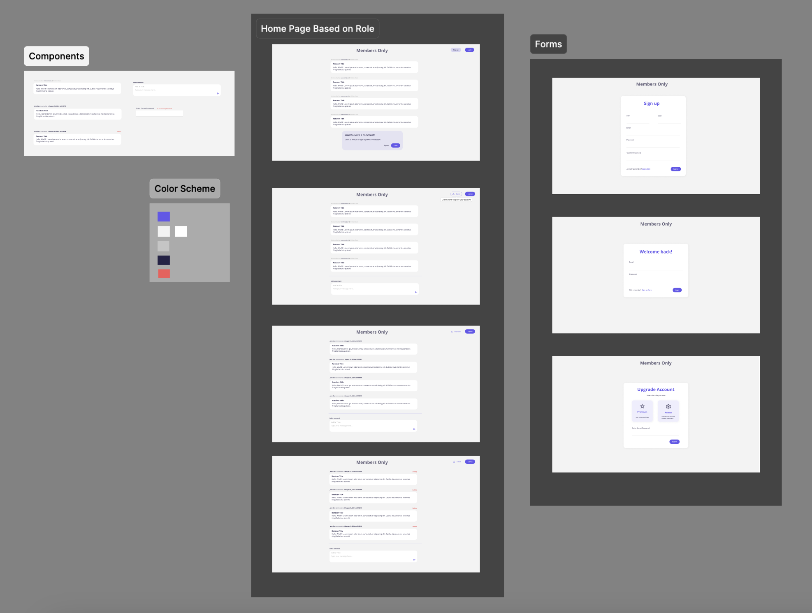

# Members Only

<!-- [Live Demo]() -->

## Purpose

To practice authentication with PassportJS using Local Strategy by creating a message board app where users can have a role of Basic, Premium, or Admin each with different visibilities and CRUD settings.

## Tools Used

Express, Node, PostgreSQL, EJS, Figma, PassportJS

## Features

- Server-side validation and sanitization of form inputs
- Upgrade user role with secret password
- Access certain CRUD functionalities based on user role

## Database Schema

## Figma Designs

